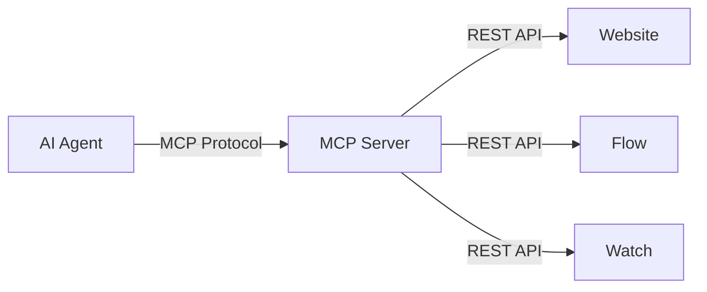

# AI Agent

Reiver exposes its platform to AI agents through the **Model Context Protocol (MCP)**. Agents can read an onboarding contract, configure prompts, query APM data, build dashboards, set up alerts, and check billing through 5 focused facade tools.

There are two ways to use it:

## External Agents (MCP)

Connect AI agents like **Claude Code**, **Cursor**, **Codex**, or any MCP-compatible client to Reiver. The MCP server is hosted at `reiver.ai/mcp` and uses Streamable HTTP transport—no local binary required. Authenticate with an **agent token** created under **Agents → Tokens**.

This is useful for:

- Automating project setup and configuration from your IDE
- Querying APM data and building dashboards conversationally
- Managing prompt versions and rollouts without the UI
- Integrating Reiver into agentic workflows and pipelines

See [Choose your Reiver path](/quickstart) for Flow, Watch, or Complete application onboarding, [MCP Setup](/agent/mcp-setup) to connect a client, and [Available Tools](/agent/tools) for the full reference.

## In-App Agent

Reiver also includes a built-in AI assistant in the web UI. It appears as a resizable overlay panel and uses the same MCP tools to act on your behalf within the platform.

To use it:

1. Configure at least one AI vendor integration (OpenAI, Anthropic, etc.) under **Prompt Hub → Integrations**
2. Select a model for the agent (or use "auto" mode)
3. Open the agent panel from the UI

The in-app agent can answer questions about your project, help configure settings, and execute actions — all within the context of your current project.

See [In-App Agent](/agent/in-app) for details.

## Architecture

The MCP server is a thin orchestration layer that sits between agents and the existing Reiver REST APIs:

No business logic is duplicated. Every tool call delegates to the same API endpoints used by the web UI, so agents always see the same data and have the same capabilities as human users.
