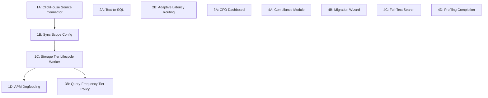

# Reiver Feature Roadmap

Derived from a simulated investor due-diligence conversation (see `docs/investor-conversation-learnings.md`) and subsequent architectural discussions.

---

## Architecture Decision: ClickHouse as a Warehouse Data Source

Add ClickHouse as a first-class data source type in Pond, with a user-configurable option to upgrade data older than N days to warm tier (R2 Parquet with FST indexes). Watch (APM) stays completely unchanged. APM dogfooding is achieved by registering Watch's ClickHouse spans and logs tables as a Pond data source.

### How it works

- User adds a ClickHouse data source in Pond (connection details, credentials)
- User picks which tables the warehouse should read (table selection UI)
- User configures two independent settings:
  1. **Sync scope**: Full sync (keep up with latest data) or time-based (only data older than N days)
  2. **Storage tier**: Cold (query in-place), Warm (Parquet on R2 with FST indexes), or Hot (ClickHouse)
- Pond reads from ClickHouse, writes data as Parquet to R2, builds FST indexes
- Old data is queryable through Pond's federated engine; recent data stays in the source ClickHouse

### APM dogfooding

Watch's ClickHouse is registered as a data source. The `spans` and `logs` tables are selected. Sync scope set to time-based (e.g. older than 12 days) so a copy lands in Warm **before** Watch’s **15-day** ClickHouse TTL drops it. Storage tier set to Warm. Watch doesn't change at all -- it keeps writing to ClickHouse, keeps its materialized views, keeps its queries, keeps its TTLs. The warehouse reads from Watch's ClickHouse as an external data source. After rows age out of hot ClickHouse, the warehouse copy remains queryable.

---

## Data Source Configuration Model

Each data source in the warehouse has two independent configuration dimensions:

### Dimension 1: Sync Scope -- *what* data does Pond read?

- **Full sync**: Pond keeps up with the latest data from the source, continuously or on schedule.
- **Time-based**: Pond only reads data older than N days (a sliding window). Useful when recent data is already served by another system (e.g., Watch serves the last ~15 days of spans/logs in its own ClickHouse before TTL).

### Dimension 2: Storage Tier -- *where* does Pond put the data?

These are the user-facing names (with internal names in parentheses):

| User-facing | Internal name | What it means | Short UI description |
|-------------|---------------|---------------|----------------------|
| **Hot** | Hot | Data copied into Pond's ClickHouse | "Data is stored in high-performance columnar storage for the fastest possible queries." |
| **Warm** | Warm | Data stored as Parquet on R2 with FST indexes | "Data is stored as indexed Parquet files on R2. Queryable with low latency at a fraction of the cost of hot storage." |
| **Cold** | Cold | Data stays at the source, queried on demand | "Data stays in its original location and is queried on demand. No storage cost, but queries are slower." |

The storage tier can be set as a single fixed tier, or as an **automatic lifecycle policy** that transitions data between tiers based on age.

### Automatic Storage Tier Lifecycle

Users can define age-based rules that automatically move data between tiers. Example policies:

| Age of data | Storage tier |
|-------------|-------------|
| 0-30 days | Hot |
| 30-90 days | Warm |
| 90+ days | Cold |

This is configured as an ordered list of tier transitions:

```rust
pub enum StorageTierPolicy {
    Fixed(StorageTier),                    // Single tier for all data
    Lifecycle(Vec<TierTransition>),        // Age-based transitions
}

pub struct TierTransition {
    pub after_days: u32,       // Transition when data is older than this
    pub tier: StorageTier,     // Move to this tier
}
```

The lifecycle policy reuses the existing upgrade/downgrade infrastructure -- transitioning from Hot to Warm is a downgrade (export ClickHouse to R2 Parquet), and transitioning from Warm to Hot is an upgrade (import R2 Parquet into ClickHouse). A background worker evaluates partition ages and triggers transitions using these existing operations.

### Configuration matrix

These two dimensions are orthogonal. Examples:

| Sync scope | Storage tier | Example use case |
|------------|-------------|------------------|
| Full sync | Hot (fixed) | Maximum query performance on all data |
| Full sync | Warm (fixed) | Cost-efficient storage of all data with indexed queries |
| Full sync | Cold (fixed) | Zero-copy federated queries against the source |
| Full sync | Lifecycle: Hot 30d -> Warm 90d -> Cold | Best of all worlds: fast recent queries, cheap long-term storage |
| Time-based (~12d) | Warm (fixed) | **APM dogfooding**: copy spans/logs older than ~12 days to warm before **15d** ClickHouse TTL |

The existing `StorageTier` enum (`Cold`, `Warm`, `Hot`) maps directly to these tiers. What's new is the sync scope dimension and the lifecycle policy.

---

## Phase 1: ClickHouse Data Source + Time-Based Sync

### 1A. ClickHouse Source Connector

Add `ClickHouse` as a `SourceType` variant in `pond/src/warehouse/types.rs`, alongside PostgreSQL, MySQL, Stripe, etc.

The connector needs:

- **Connection config**: Host, port, database, credentials (similar to how PostgreSQL sources are configured)
- **Schema discovery**: Query ClickHouse `system.columns` and `system.tables` to list available tables and their schemas
- **Table selection UI**: Users pick which tables the warehouse should read. Not all tables in a ClickHouse instance are relevant -- the user selects the ones they want. This is a multi-select in the source configuration UI.
- **Read path**: Query selected ClickHouse tables through Pond's federated engine (ClickHouse already has a native client in the codebase)
- **Catalog registration**: Selected tables and their schemas get registered in `warehouse_catalog`

The `SourceBackend::ClickHouseNative` backend already exists in `pond/src/warehouse/sources/types.rs` -- we're adding the source connector that discovers and reads from external ClickHouse instances.

### 1B. Sync Scope Config

Add a `SyncScope` to `RegisteredSource` in `pond/src/warehouse/sources/types.rs`:

```rust
pub enum SyncScope {
    Full,                      // Sync all data from the source
    TimeBased {
        older_than_days: u32,  // Only sync data older than this (default: 30)
    },
    // Future: QueryFrequency { promote_threshold: u64, demote_threshold: u64 }
}
```

- User-facing config: when adding/editing a data source, choose "Full sync" or "Time-based" with a day threshold
- `Full` = current behavior, backward compatible
- `TimeBased` = Pond only reads data older than N days from the source
- Independent of storage tier -- user separately picks Cold, Warm, or Hot
- Requires a new column on `warehouse_sources` PostgreSQL table

### 1C. Storage Tier Lifecycle Worker

A background worker that evaluates partition ages and triggers tier transitions using the existing upgrade/downgrade infrastructure:

- **Scan**: Periodically check all sources with `StorageTierPolicy::Lifecycle`
- **Evaluate**: For each partition, determine which tier it should be in based on its age and the configured transitions
- **Transition**: Trigger the appropriate operation:
  - Hot -> Warm: reuse existing downgrade logic (`execute_downgrade()` in `pond/src/warehouse/sync/sync_job_consumer.rs` -- exports ClickHouse data to R2 Parquet, drops ClickHouse partition)
  - Warm -> Cold: drop R2 Parquet copy, switch to query-on-demand from the original source
  - Cold -> Warm or Warm -> Hot: reuse existing upgrade logic (import to ClickHouse or upgrade to warm)
- **Track state**: Record current tier per partition and last evaluation time to avoid redundant transitions
- **No deletion from source**: Pond never deletes data from the external source. The source's own TTL handles cleanup. Pond ensures it has a copy before the source TTL expires.

This worker also handles the simpler time-based sync case (1B) -- syncing data older than N days into a fixed tier is just a lifecycle with a single transition.

**Important**: For sources with TTLs (e.g., APM spans/logs with **15-day** TTL), the sync must run before the TTL deletes the data. Pond should sync several days inside that window (e.g. ~12–13 days) to have a safety margin.

### 1D. APM Dogfooding

Register Watch's ClickHouse as a Pond data source:

- Source type: `ClickHouse`
- Selected tables: `spans`, `logs`
- Sync scope: `TimeBased { older_than_days: 12 }` (tune just under spans/logs **15-day** TTL)
- Storage tier: Warm (Parquet on R2 with FST indexes)
- Watch stays completely unchanged -- same ClickHouse writes, same MVs, same queries for recent data
- After hot retention, APM data remains queryable through Pond's query engine or pgwire interface

### APM data retention context

For reference, current APM ClickHouse TTLs:

| Data | Retention |
|------|-----------|
| Spans | 15 days |
| Logs | 15 days |
| Exceptions | No TTL (kept forever) |
| Raw metrics (`samples_v1`) | 30 days |
| Time series metadata (`time_series_v1`) | 30 days |
| 5-min metric aggregations | 90 days |
| 30-min metric aggregations | 365 days |
| Log template hourly | 14 days |

Spans and logs are the highest-volume data types and the ones that benefit most from Warm storage. They are the initial targets.

---

## Phase 2: Text-to-SQL + Adaptive Latency Routing

These are independent of Phase 1 and can start in parallel.

### 2A. Text-to-SQL

Bridge the Gateway and Warehouse:

- **New endpoint** in Pond: `POST /api/warehouse/v1/query/natural-language`
- **Schema context**: Pull table schemas, column types, sample values from `warehouse_catalog` in PostgreSQL
- **Prompt construction**: Build a system prompt with schema context, then send the user's natural language query to Flow's `/api/gateway/v1/chat/completions` endpoint
- **SQL validation**: Parse and validate the generated SQL before execution (prevent injection, ensure only SELECT)
- **Execution**: Run through the existing federated query engine
- **Iteration**: If the query fails, send the error back to the LLM for self-correction (1-2 retries)

The Gateway's chat completion API and the Warehouse's catalog + query engine both exist. The work is the glue layer and prompt engineering for reliable SQL generation across the 40+ connector types.

### 2B. Adaptive Latency-Based LLM Routing

Extend the Gateway router in `flow/src/gateway/router.rs` and fallback logic in `flow/src/gateway/fallback.rs`:

- **Latency tracker**: Rolling window (e.g., last 5 minutes) of P50/P95/P99 per provider, stored in-memory with periodic Redis snapshots for cross-instance sharing
- **Routing logic**: When multiple providers serve the same model class, prefer the one with lowest P95. Fall back immediately (don't wait for timeout) when a provider's P99 exceeds a configurable threshold
- **Degradation alerts**: Emit alerts when a provider's latency degrades significantly (integrate with the existing alerting system)
- **Dashboard**: Expose latency percentiles per provider in the LLM metrics API

---

## Phase 3: CFO Dashboard + Automated Tier Policy

### 3A. CFO Cost-Savings Dashboard

- **Backend**: New endpoint that calculates: data volume ingested, Reiver cost (from billing), estimated Datadog cost (using Datadog's public pricing: ~$0.10/GB ingestion + $1.70/million spans for APM)
- **Frontend**: Dashboard widget showing side-by-side cost comparison with savings highlighted
- **Data source**: The `usage_hourly` materialized views already track spans/logs/metrics volume per project -- this is the input

### 3B. Query-Frequency Tier Policy

Age-based lifecycle policies are handled in Phase 1C. This adds a query-frequency dimension: automatically adjust tiers based on how often data is accessed, not just how old it is.

- **Query tracking**: Log query frequency per table/partition (ClickHouse `system.query_log` or custom tracking)
- **Policy evaluation**: Periodically evaluate: if a Warm partition is queried frequently, suggest/auto-promote to Hot. If a Hot partition hasn't been queried in N days, suggest/auto-demote to Warm.
- **API**: CRUD for policy rules per source
- **Depends on**: Phase 1's lifecycle worker being in place

---

## Phase 4: Enterprise Features

### 4A. Compliance Module

- **PII detection**: Scan column names and sample data for PII patterns (email, phone, SSN, credit card) across warehouse sources
- **Compliance rules**: Configurable rule sets for GDPR, PCI DSS, HIPAA
- **Scanning jobs**: Scheduled scans that flag violations
- **Start narrow**: Column-name heuristics + regex on sample data. Expand to ML-based detection later
- **Leverage**: The APM already has PII masking logic -- extract and generalize it

### 4B. Migration Wizard

- **Datadog dashboard import**: Parse Datadog dashboard JSON export format, map widget types to Reiver equivalents
- **Scope**: Start with the most common widgets (timeseries, query value, top list, table) -- aim for 80% coverage
- **New Relic**: Lower priority, add after Datadog

### 4C. Full-Text Search on Data Content

- **Extend FST indexes** in `pond/src/warehouse/indexes/` to index actual column values in Parquet files, not just catalog metadata
- **Selective indexing**: User marks columns for full-text indexing (not all columns -- that would be prohibitively expensive)
- **Build on freeze**: When partitions freeze, build content-level FST indexes for marked columns
- **Query integration**: New `CONTAINS` or `SEARCH` predicate in the query engine that uses these indexes

### 4D. Finish Continuous Profiling

- Follow the existing `PROFILING_IMPLEMENTATION_PLAN.md`
- Key gaps: profile data storage logic, flame graph generation, profile comparison endpoints, deployment comparison
- The OTLP endpoint and ClickHouse schema already exist

---

## Dependency Graph



**Phase 1 order**: 1A -> 1B -> 1C -> 1D

Phase 2, 3A, and Phase 4 items (except 3B) are independent of Phase 1 and can be started in parallel.

---

## Terminology Note

Throughout all documentation and investor materials, use "tier" language, not "archive" language when referring to R2+FST storage. R2 with FST indexes is a warm, queryable storage tier -- not an archive. Data tiered to R2 remains queryable through the federated engine. Calling it "archived" undermines the competitive positioning against Datadog, where old data is truly archived or deleted.

- Use: "data tiers from ClickHouse to R2"
- Avoid: "data is archived to R2"
- Use: "warm queryable tier"
- Avoid: "archive tier" or "cold storage"
