# Pond -- Reiver Data Warehouse

Pond is Reiver's data warehouse service. It syncs data from external sources
(databases, SaaS APIs, files) into columnar storage, queries it through
ClickHouse, and exposes both an HTTP API and a PostgreSQL-compatible wire
protocol so BI tools can connect using standard SQL.

## Architecture Overview

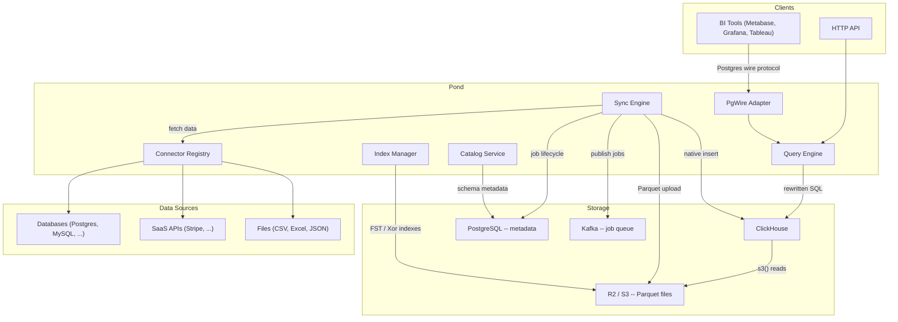

## Storage Tiers

Pond organizes data into three storage tiers. Each tier trades latency for cost,
and data can move between tiers automatically or on demand.

| Tier | Storage | Query Path | Indexed | Use Case |
|------|---------|-----------|---------|----------|
| **Cold** | None (external source) | Fetch on-demand via connector | No | Infrequent queries, API sources |
| **Warm** | Parquet files in R2/S3 | ClickHouse `s3()` function | FST + Xor + MinMax | Cost-efficient, most common |
| **Hot** | Native ClickHouse MergeTree | Direct ClickHouse query | ClickHouse native | Sub-second queries, high traffic |

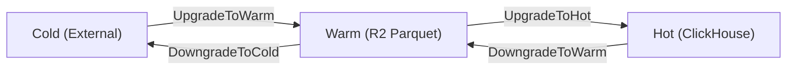

Tier transitions are managed by the **lifecycle worker**, which evaluates access
patterns and data age on an hourly schedule. Transitions can also be triggered
manually through the API.

## Data Sync Pipeline

When a sync runs, data flows from the external source through the connector,
gets converted to Parquet, and lands in object storage or ClickHouse.

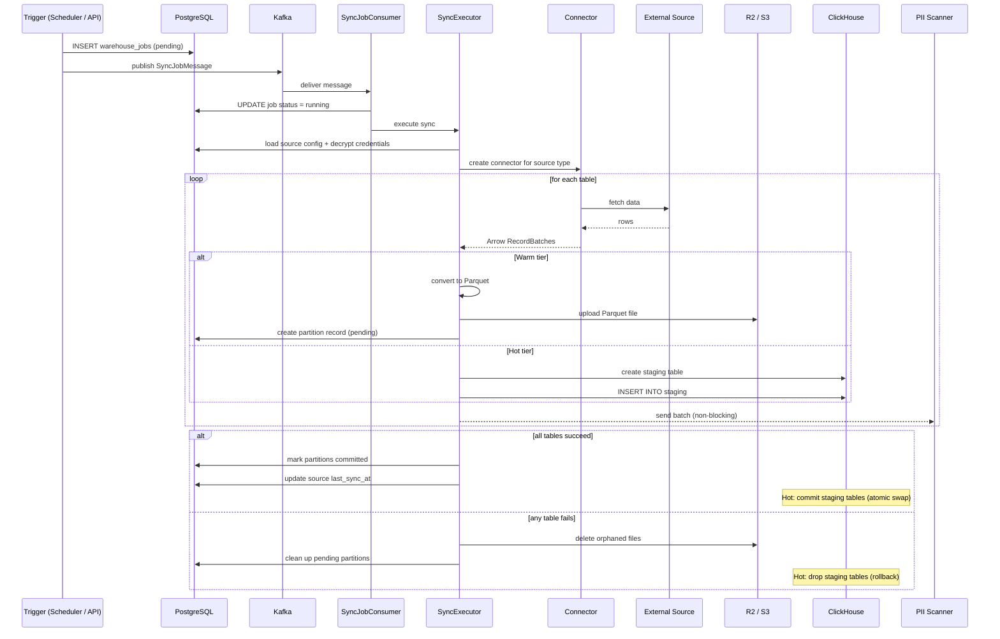

### Sync triggers

- **Interval scheduler** -- checks every 30s for sources past their `sync_interval`
- **Cron scheduler** -- fires at configured cron expressions
- **Manual trigger** -- immediate sync via API call
- **Lifecycle worker** -- tier transitions (upgrade/downgrade)

All triggers create a job record in PostgreSQL and publish to Kafka. The
`SyncJobConsumer` processes jobs with deduplication (skips if a pending/running
job already exists for the same source).

### Partition management

Warm-tier data is organized by date partitions:

```
projects/{project_id}/warm/{source_name}/{table_name}/{YYYY-MM-DD}/{partition_id}.parquet
```

Partitions have two lifecycle states:

- **Mutable** -- recent partitions (< 1 day old), indexed with Roaring Bitmaps
- **Frozen** -- old partitions, re-indexed with FST + MinMax for efficient pruning

## Query Execution Pipeline

When a SQL query arrives (via HTTP API or PgWire), it goes through rewriting,
index-based file pruning, and streaming execution against ClickHouse.

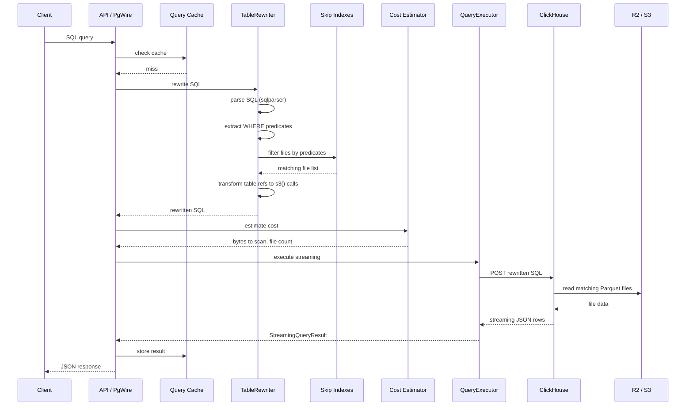

### Query rewriting steps

1. **Parse** -- SQL is parsed into an AST using `sqlparser` with the ClickHouse dialect
2. **Extract predicates** -- equality, range, prefix, and substring predicates are pulled from `WHERE`
3. **Date partition pruning** -- date ranges narrow which partitions to scan
4. **Skip index filtering** -- FST/Xor/MinMax indexes eliminate files that cannot match
5. **Table transformation** -- table references become `s3('pattern', 'Parquet')` calls with only matching files
6. **Predicate pushdown** -- predicates are classified into file-level (pre-scan), `PREWHERE` (column-level), and `WHERE` (row-level)

## Skip Index System

Skip indexes let Pond eliminate Parquet files before ClickHouse reads any data.
For a table with thousands of files, this can reduce I/O by orders of magnitude.

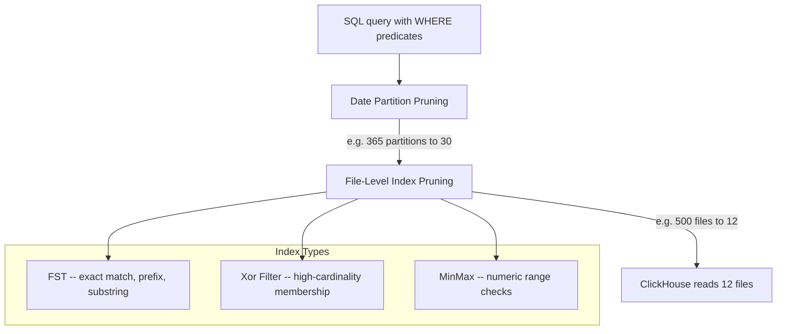

### Index types

| Index | Data Structure | Best For | False Positives |
|-------|---------------|----------|-----------------|
| **FST** | Finite State Transducer | Low-cardinality strings, exact/prefix/substring match | None |
| **Xor Filter** | Xor8 probabilistic filter | High-cardinality values (IDs, emails) | ~0.4% |
| **MinMax** | Min/max boundaries | Numeric range queries (`age > 21`) | Possible (value in range but not in file) |

### Hierarchical skip index

For partitioned tables, indexes work at two levels:

1. **Partition summary** -- coarse FST over all values in a partition; eliminates entire date partitions
2. **Per-file index** -- fine-grained FST/Xor/MinMax per Parquet file within surviving partitions

The `HierarchicalSkipIndex` combines both levels, first pruning partitions, then
pruning individual files within matching partitions.

### Full-text search

String columns can be configured for full-text indexing. When enabled, FST
indexes support substring queries (`LIKE '%term%'`) using a regex-automata DFA
that walks the FST, avoiding full scans.

## PostgreSQL Wire Protocol Adapter

The PgWire adapter lets BI tools (Metabase, Grafana, Tableau, DBeaver, psql)
connect to Pond as if it were a PostgreSQL database.

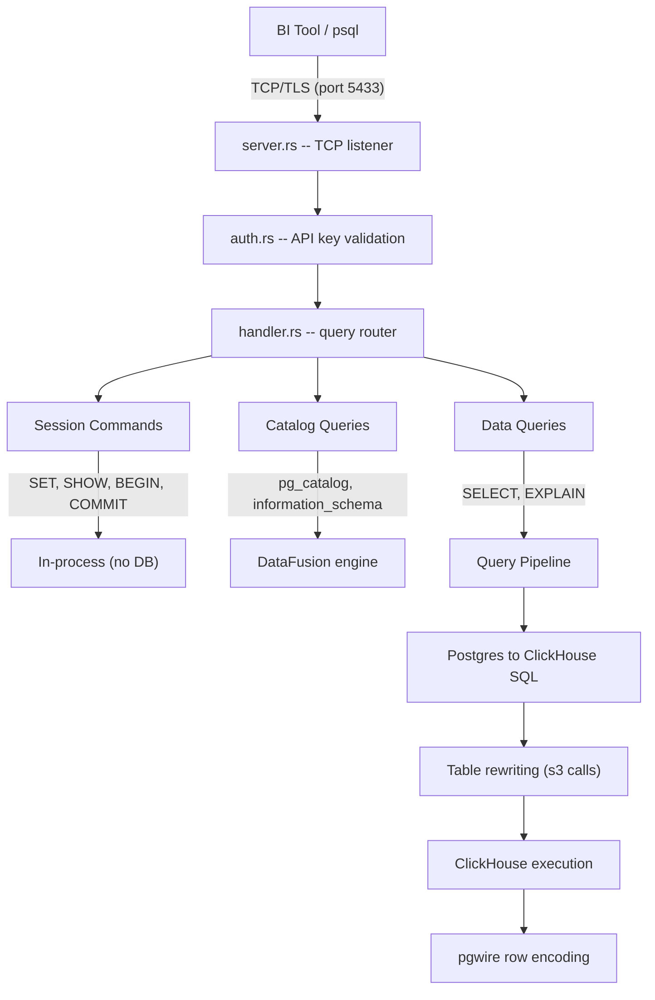

### Query classification

Every incoming SQL statement is classified into one of three categories:

- **Session commands** -- `SET`, `SHOW`, `BEGIN`, `COMMIT`, `ROLLBACK`, etc. Handled in-process with no database round-trip.
- **Catalog queries** -- queries targeting `pg_catalog` or `information_schema`. Executed locally via DataFusion against cached catalog metadata.
- **Data queries** -- `SELECT` and `EXPLAIN` statements. Translated from Postgres dialect to ClickHouse SQL, rewritten with `s3()` file patterns, and executed against ClickHouse.

### Limits

- 100K rows max per result set
- 120s query timeout
- 200MB memory budget per query
- Read-only: only `SELECT` and `EXPLAIN` are allowed

## Connectors

Connectors implement a unified `Connector` trait that provides schema discovery,
data fetching (buffered and streaming), credential validation, and optional
capabilities like CDC and SQL pushdown.

### Databases

| Connector | Streaming | CDC | SQL Pushdown |
|-----------|-----------|-----|-------------|
| PostgreSQL | Yes | Yes (logical replication) | Yes |
| MySQL | Yes | Yes (binlog) | Yes |
| SQL Server | Yes | Yes (CDC tables) | Yes |
| MongoDB | Yes | Yes (change streams) | No |
| ClickHouse | Yes | No | Yes |
| Snowflake | Yes | No | Yes |
| BigQuery | Yes | No | Yes |
| Redshift | Yes | No | Yes |
| SQLite | No | No | Yes |

### SaaS APIs

| Connector | Streaming | Notes |
|-----------|-----------|-------|
| Stripe | No | REST API, paginated fetch |
| Google Sheets | No | OAuth-based |

### Files

| Connector | Formats |
|-----------|---------|
| CSV | `.csv`, `.tsv` |
| Excel | `.xlsx`, `.xls` |
| JSON | `.json`, `.jsonl` |

## Federated Queries

When a SQL query references tables from multiple sources, the federation planner
splits the query into sub-queries that each target a single source, then
combines the results.

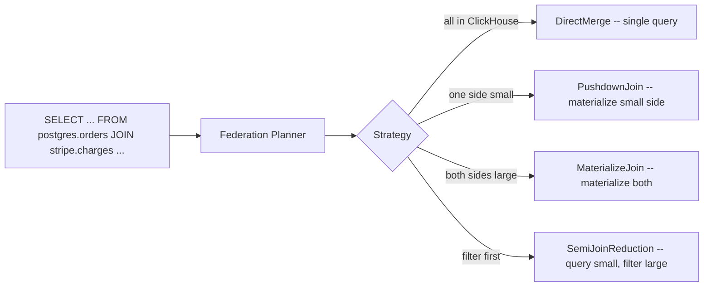

The planner analyzes table sizes, join conditions, and source capabilities to
choose the cheapest strategy. Schema compatibility across sources is validated
before execution.

## Catalog Service

The catalog provides unified metadata management across all connected sources.

- **Schema discovery** -- auto-discovers tables, columns, and types from each source
- **Relationship inference** -- detects foreign key relationships across sources by analyzing column names and types
- **Lineage tracking** -- tracks column-level data lineage (which source columns feed which warehouse columns)
- **Statistics** -- row counts, data size, cardinality estimates per column
- **Search** -- full-text search across table names, column names, and descriptions

The catalog is refreshed on each sync and cached with a 60s TTL per project.

## Running Pond

### Modes

Pond runs as a single binary with three modes:

```bash
# Run everything (default)
reiver-pond --mode all

# API server only (HTTP + PgWire, no background workers)
reiver-pond --mode api

# Background workers only (sync, lifecycle, freeze scheduler)
reiver-pond --mode workers
```

### Testing

```bash
# Run all unit tests (lib)
cargo test --lib

# Run all tests including integration tests
cargo test

# Run skip index tests
cargo test --lib warehouse::indexes::skip_index::tests

# Run query rewriter tests
cargo test --lib warehouse::query::rewriter::tests
```

## BI Compatibility Testing

Compatibility with BI tools requires more than just the wire protocol. The full
stack involves session commands, catalog introspection, SQL dialect translation,
parameter binding, and type encoding. We test this at three levels:

### Level 1: Query Corpus Tests (Rust unit tests)

Pure Rust tests that feed known BI-tool SQL through the routing and translation
pipeline. No network, no running server -- just function calls. These run in
milliseconds and catch regressions in session handling, catalog detection,
dialect translation, and the read-only guard.

**What is tested:**

| Function | Module | Purpose |
|----------|--------|---------|
| `classify_session_command()` | `session.rs` | SET/SHOW/BEGIN routed correctly |
| `is_catalog_query()` | `catalog.rs` | pg_catalog/information_schema detected |
| `translate_to_clickhouse()` | `dialect.rs` | Postgres SQL rewritten for ClickHouse |
| `enforce_read_only()` | `handler.rs` | All queries pass the read-only guard |
| `bind_parameters()` | `handler.rs` | $1/$2 placeholders replaced via AST |

**BI tools covered:**

- **Metabase** (JDBC) -- connection init, schema discovery, data queries
- **Grafana** (pgx/Go) -- parameterized queries, timestamp casts
- **DBeaver** (JDBC) -- schema tree population, information_schema queries
- **Apache Superset** (psycopg2) -- date functions, parameterized schema queries

**Run:**

```bash
cargo test --lib pgwire::bi_compat_tests
```

### Level 2: Wire Protocol Tests (Rust integration tests)

Integration tests that start the pgwire server on a random port, connect with
`tokio-postgres` (a real Postgres client library), and exercise the full wire
protocol path: auth, extended query protocol, parameter binding, type encoding,
and TLS negotiation.

These require a mock `QueryExecutor` (no real ClickHouse) and run in seconds.

**What is tested:**

- Startup handshake and authentication
- Simple and extended query protocol
- Prepare / Bind / Describe / Execute flow
- Parameter type inference and binding
- Binary and text format encoding
- SHOW ALL multi-row result
- TLS negotiation (when certs are provided)

**BI tool connection flows covered:**

- JDBC driver startup sequence (Metabase, DBeaver, Looker)
- pgx/Go driver startup sequence (Grafana)
- psycopg2 driver startup sequence (Superset)

**Run:**

```bash
cargo test --test pgwire_integration
```

### Level 3: BI Tool Smoke Tests (Docker, CI only)

Docker-based tests that start actual BI tools, configure a Postgres data source
pointing at the pgwire server, and verify connection + schema discovery via
their REST APIs. These run in minutes and are intended for CI pipelines.

**Tools tested:**

| Tool | Image | Verification |
|------|-------|-------------|
| Metabase | `metabase/metabase` | POST /api/database, check sync status |
| Grafana | `grafana/grafana` | POST /api/datasources, run test query |
| Superset | `apache/superset` | Create database connection via API |

**How it works:**

1. Start pgwire server with test credentials
2. Start BI tool container with `docker run`
3. Use the tool's REST API to add a Postgres data source
4. Assert the connection succeeds and schema discovery completes
5. Run a simple query and verify results

**Run:**

```bash
# Requires Docker
make test-bi-smoke
```

## Index Deep Dive

Pond uses six index types, each chosen for specific access patterns and
cardinality ranges. This section covers how each works internally, where they
are stored, and how they flow from build time to query time.

### Finite State Transducers (FST)

An FST is a compressed, immutable automaton that shares both prefixes and
suffixes across keys. Unlike a trie (which only shares prefixes), an FST can
represent a sorted set of strings in significantly less space.

Pond uses two FST variants:

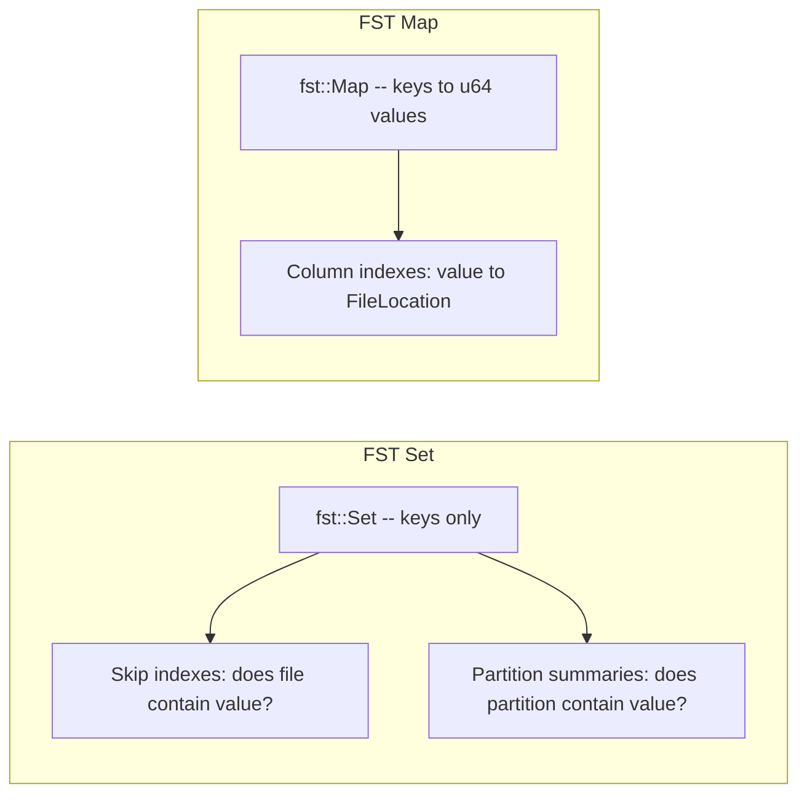

**Build algorithm:**

1. Collect all string values for the column
2. Sort and deduplicate -- O(n log n)
3. Insert in sorted order into `SetBuilder` or `MapBuilder` -- O(n)
4. Finalize into an immutable byte array

**Query algorithms:**

| Operation | Algorithm | Complexity |
|-----------|-----------|------------|
| Exact match | Walk FST states byte-by-byte | O(key_len) |
| Prefix search | Range query `[prefix, prefix+1)` over FST stream | O(log n + k) where k = matches |
| Substring search | Compile `.*term.*` to dense DFA, walk FST + DFA in lockstep | O(n) worst case, sublinear with dead-state pruning |

**Substring search in detail:**

The `SubstringAutomaton` compiles the pattern `.*<escaped_term>.*` into a
deterministic finite automaton using the `regex-automata` crate. During FST
traversal, each byte transition is fed to both the FST and the DFA
simultaneously. When the DFA enters a dead state (no possible future match),
that entire FST subtree is pruned. This avoids scanning branches that cannot
contain the substring.

The DFA is capped at 256 KB. If the pattern produces a DFA exceeding this
limit, the automaton falls back to conservatively reporting "might match" for
all keys.

**Memory:**

- Compressed shared prefixes and suffixes: roughly 3-10 bytes per key
- Summary FSTs capped at 100K keys or 50 MB
- Immutable once built (must rebuild to modify)

**Union operation:**

When building partition or global summaries, two FSTs are merged via streaming
union (`fst::set::OpBuilder`). Both FSTs are iterated in sorted order and a new
FST is built from the merged stream. Complexity: O(a + b) where a and b are the
sizes of the two FSTs.

### Xor Filter (BinaryFuse8)

A Xor filter is a probabilistic membership structure similar to a Bloom filter,
but more space-efficient and faster to query. Pond uses the `BinaryFuse8`
variant from the `xorf` crate.

**How it works:**

1. **Build** -- Hash all values to u64. Construct a 3-segment table where each
   element maps to three positions. XOR the fingerprints so that querying any
   element produces the correct fingerprint. Build time: O(n).
2. **Query** -- Hash the value, look up three table positions, XOR them
   together, compare the fingerprint. Query time: O(1) constant.
3. **False positives** -- ~0.4% probability that a non-existent value reports as
   present. No false negatives: if a value exists, it always reports present.

**Memory:** ~9 bits per element, independent of key length. For 1 million
values, the filter occupies approximately 1.125 MB.

**When used:** The strategy selector chooses Xor filters when cardinality
exceeds 100K and selectivity is <= 0.5 (values repeat enough for filtering
to eliminate files).

### MinMax Statistics

The simplest index type: store the minimum and maximum value seen in each
numeric column for each file.

**Build:** Single-pass scan over column values -- O(n).

**Query:** O(1) range check:
- Equality: `value >= min && value <= max`
- Greater than: `max > threshold`
- Less than: `min < threshold`

**Memory:** 32 bytes per column per file (two f64 values plus null count and
value count).

**False positives:** A value in [min, max] may not actually exist in the file.
There are no false negatives -- if a value is outside the range, the file is
definitely excluded.

### Roaring Bitmap

Roaring Bitmaps are compressed integer sets that adapt their internal storage
based on data density:

| Density | Storage | Cost per Element |
|---------|---------|-----------------|
| Sparse (< 4096 values in a 64K chunk) | Sorted u16 array | 2 bytes |
| Dense (>= 4096 values in a 64K chunk) | Bitmap | 1 bit |
| Sequential runs | Run-length encoding | ~4 bytes per run |

Pond uses Roaring Bitmaps (`roaring::RoaringBitmap`) to track which file IDs
contain a given value in mutable partitions.

**Operations:**
- Membership: O(1) average
- Intersection (AND of two sets): O(min(n, m))
- Union (OR of two sets): O(n + m)

**Use case:** Mutable partitions (data less than 1 day old) where rows are still
being added. When a partition freezes, Roaring Bitmaps are replaced by FST
indexes which are more compact for read-only access patterns.

### HyperLogLog

A probabilistic cardinality estimator used during sync to decide which index
strategy to apply to each column. It does not participate in query-time
filtering.

**Configuration:** 4096 registers (12-bit precision), 6-bit register width,
WyHash hasher.

**Operations:**
- Insert: O(1) per value -- hash and update one register
- Estimate: O(1) -- harmonic mean across all registers
- Merge: O(m) where m = register count -- take per-register max

**Error:** ~1-2% standard error for cardinality estimates.

**Memory:** ~1.6 KB fixed, regardless of how many values are inserted.

### Automatic Strategy Selection

When a partition freezes, the index manager uses column statistics from
HyperLogLog to choose the optimal index type for each column.

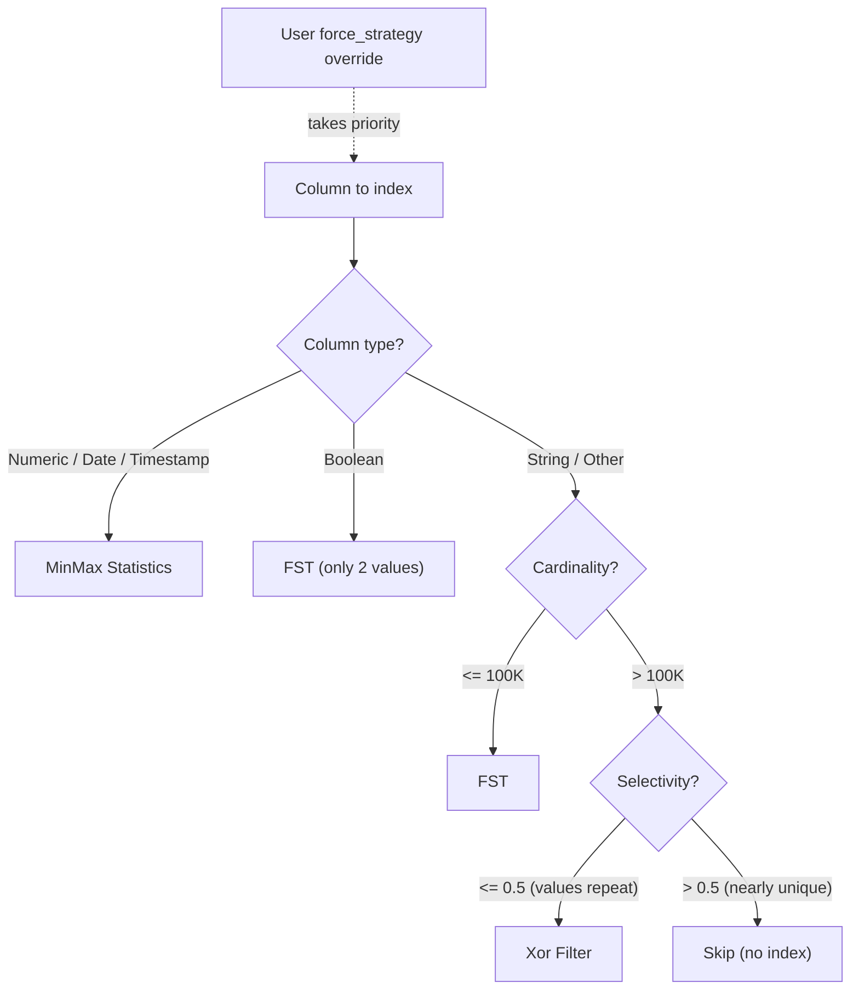

**Key thresholds:**
- FST ceiling: 100K unique values (above this, summaries become too expensive)
- Xor filter selectivity: values must repeat in at least 50% of rows to be
  worth filtering
- Skip: nearly-unique columns (like UUIDs) are not indexed because filtering
  would eliminate very few files

### Hierarchical Skip Index

For tables with many files across date partitions, the hierarchical skip index
provides three-level pruning to avoid checking every file individually.

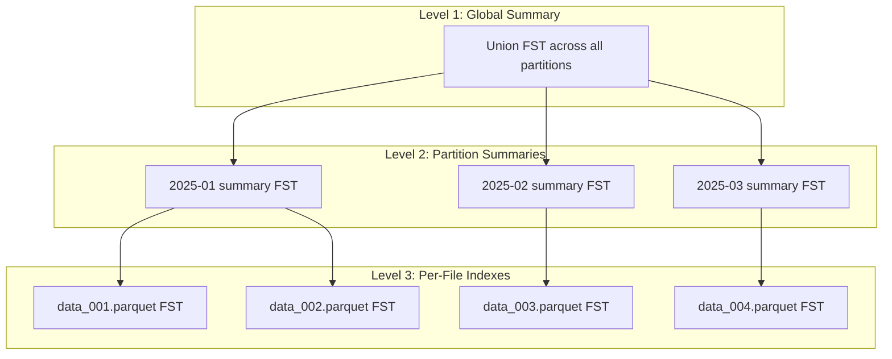

**Query pruning flow:**

1. **Global check** -- if the value does not exist anywhere in the global
   summary, return immediately with zero files
2. **Partition pruning** -- check each partition's summary FST; skip entire
   partitions where the value cannot exist. O(p) where p = partition count
3. **File pruning** -- within matching partitions, check each file's FST; return
   only files where the value might exist. O(f) where f = files in matching
   partitions

For a table with 1 million files across 1000 date partitions, a query that
targets a single date and a specific value might prune from 1M files down to
1000 (date pruning) and then to 3 (value pruning).

**Memory safety:**
- High-cardinality columns (> 100K unique values) are excluded from partition
  and global summaries to prevent memory explosion
- Before computing a union, cardinality is estimated from FST byte size; if the
  estimate exceeds the threshold, the union is skipped
- Each summary FST is capped at 50 MB

### Index Storage and Retrieval

Indexes follow a build-serialize-store-load-cache lifecycle. The complete flow
from index creation at sync time to usage at query time:

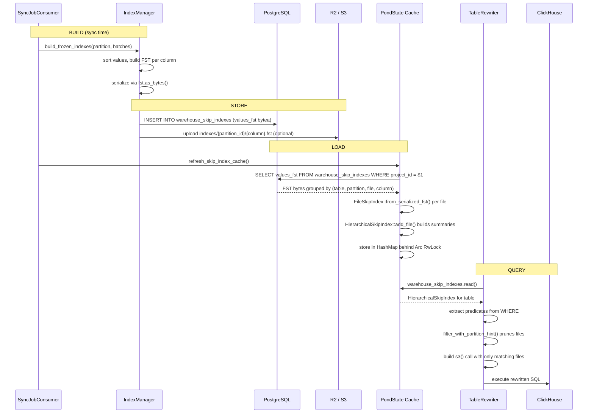

**Where indexes are stored:**

| Location | Format | What | When |
|----------|--------|------|------|
| PostgreSQL `warehouse_skip_indexes` | Raw FST bytes in `values_fst` (bytea) | Primary store for all skip indexes | Written at sync, read at startup and cache refresh |
| R2 / S3 `indexes/{partition_id}/{column}.fst` | `.fstx` envelope (magic + version + metadata + FST) | Optional durable copy of column indexes | Written at sync (if R2 configured) |
| In-memory `PondState.warehouse_skip_indexes` | `HashMap<ProjectId, HashMap<TableName, HierarchicalSkipIndex>>` | Query-time access | Built from PostgreSQL at startup and after each sync |

**Serialization formats:**

The `.fstx` format used for R2 storage:
```
[4 bytes] magic "FSTX"
[1 byte]  version (1)
[1 byte]  index type (1=cache, 2=skip, 3=column)
[4 bytes] metadata length (u32 LE)
[N bytes] JSON metadata
[4 bytes] FST length (u32 LE)
[M bytes] raw FST bytes
```

For PostgreSQL, raw FST bytes are stored directly in the `values_fst` bytea
column without the wrapper envelope.

**Cache lifecycle:**

- **Startup:** `preload_skip_indexes_at_startup()` loads indexes for all active
  projects in parallel background tasks
- **Query time:** `try_rewrite_with_skip_indexes()` reads the in-memory cache
  via `RwLock::read()`. On cache miss, a background load task is spawned and the
  current query falls back to a non-optimized file pattern
- **After sync:** `refresh_skip_index_cache()` reloads the affected project's
  indexes from PostgreSQL and updates the cache under a write lock
- **Concurrency:** `Arc<RwLock>` allows many concurrent readers with exclusive
  writes. A `SkipIndexLoadingTracker` (`Mutex<HashSet<Uuid>>`) prevents
  duplicate load tasks for the same project

### Mutability Model

FST, Xor Filter, and MinMax indexes are immutable -- they are never updated in
place. Pond uses a **replace-not-update** model at the partition level. When
source data changes, the entire partition (Parquet files + indexes) is replaced.

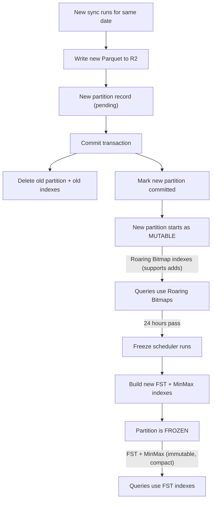

**How it works step by step:**

1. A sync fetches fresh data from the source and writes new Parquet files for
   the affected date partitions, tracked as `sync_state = 'pending'`
2. On commit, within a single database transaction: new partitions are marked
   `committed` and old partitions for the same (source, table, date) are deleted
   along with their index rows
3. The new partition starts in **mutable** state, indexed with Roaring Bitmaps
   that support incremental adds
4. After 24 hours without updates, the freeze scheduler transitions the
   partition to **frozen** state and builds FST + MinMax indexes
5. The in-memory skip index cache is refreshed after each sync via
   `refresh_skip_index_cache()`

**Why this works:** By the time a partition is frozen and FST-indexed, it is old
enough that updates are rare. If a sync does produce new data for a frozen
partition's date, the entire partition is replaced -- the old FST is discarded
and the cycle starts over from the mutable state. This avoids the complexity of
incremental FST or Xor filter updates entirely. The trade-off is that during
the 24-hour mutable window after a re-sync, queries use Roaring Bitmaps (less
compact but mutable) instead of FSTs.

### Parquet File Size: Why 64 MB

Pond caps individual Parquet files at **64 MB** (uncompressed). Smaller files
give the skip-index system finer granularity: when a query's predicates match
only a fraction of the data, more files can be pruned, so ClickHouse reads less
from object storage.

We benchmarked 128 MB vs 64 MB files across 17 query types at three data
volumes (500 MB, 2 GB, 8 GB) on a local ClickHouse + MinIO stack, using real
Pond `HierarchicalSkipIndex` pruning. Key results at **8 GB** (64 x 128 MB vs
128 x 64 MB files, 14-column schema):

| Query | 128 MB | Files | 64 MB | Files | Delta |
|---|---|---|---|---|---|
| Full scan (count) | 15 ms | 64 | 18 ms | 128 | +23.6% |
| Eq (status) | 55 ms | 22 | 75 ms | 43 | +36.0% |
| Eq (region) | 53 ms | 8 | 45 ms | 16 | -16.0% |
| Combined (stat+reg) | 58 ms | 3 | 29 ms | 6 | **-50.3%** |
| Substr (customer_id) | 40 ms | 9 | 33 ms | 9 | -16.1% |
| Hi-card eq (email) | 20 ms | 1 | 13 ms | 1 | **-35.5%** |
| Aggregation | 205 ms | 64 | 280 ms | 128 | +36.6% |
| Timestamp range | 55 ms | 64 | 96 ms | 128 | +73.3% |
| Wide aggregation | 500 ms | 64 | 576 ms | 128 | +15.3% |

*Negative delta = 64 MB faster. Positive = 128 MB faster.*

Scaling across volumes (delta% of 64 MB vs 128 MB):

| Query | 500 MB | 2 GB | 8 GB |
|---|---|---|---|
| Combined (stat+reg) | -20.2% | -13.1% | **-50.3%** |
| Hi-card eq (email) | -34.0% | -23.1% | -35.5% |
| Substr (customer_id) | -26.7% | -13.9% | -16.1% |
| Aggregation | +24.9% | +13.6% | +36.6% |
| Timestamp range | +3.1% | +27.6% | +73.3% |

**Why 64 MB wins overall:**

- **Selective queries get dramatically faster** -- combined filter queries saw up
  to 50% speedup at 8 GB because 64 MB files give skip indexes twice the
  pruning resolution.
- **Full scans and aggregations favor 128 MB** -- fewer files means less
  per-file overhead. But these are exactly the queries that *time-based
  partitioning* solves: if data is partitioned by date, a timestamp range scan
  already skips entire partitions (directories), making the per-file size
  irrelevant for that axis.
- **The 64 MB advantage grows with data size** -- the combined filter delta went
  from -20% at 500 MB to -50% at 8 GB, while the full-scan penalty only grew
  modestly.

The trade-off is clear: use time-based partitioning for range scans, and 64 MB
files for maximum skip-index effectiveness on selective queries. This
combination gives the best of both worlds.

### Complexity Summary

| Index | Build | Point Lookup | Range / Prefix | Membership | Memory per Element | False Positive Rate |
|-------|-------|-------------|---------------|-----------|-------------------|-------------------|
| FST Set | O(n log n) | O(key_len) | O(log n + k) | -- | ~3-10 bytes | None |
| FST Map | O(n log n) | O(key_len) | O(log n + k) | -- | ~3-10 bytes + 8 | None |
| Xor Filter | O(n) | -- | -- | O(1) | ~1.125 bytes | ~0.4% |
| MinMax | O(n) | -- | O(1) | -- | 32 bytes / column | Possible |
| Roaring Bitmap | O(n) | O(1) | O(min(n, m)) | O(1) | 1-16 bits adaptive | None |
| HyperLogLog | O(1) / insert | -- | -- | -- | 1.6 KB fixed | ~1-2% error |

**Hierarchical query complexity:**

| Scenario | Complexity |
|----------|-----------|
| Flat scan (no hierarchy) | O(n * log m) where n = files, m = values per file |
| Hierarchical, no partition hints | O(p * log s) + O(f_match * log m) where p = partitions, s = summary size |
| Hierarchical, with partition hints | O(h) + O(f_hint * log m) where h = hint count |

## Module Map

```
pond/src/
  main.rs                    -- binary entry point, CLI arg parsing
  lib.rs                     -- crate root, re-exports modules
  app_state.rs               -- shared application state (PondState)
  telemetry.rs               -- OpenTelemetry traces, metrics, logs

  api/
    warehouse.rs             -- HTTP endpoints (query, sync, sources)
    catalog.rs               -- catalog API endpoints

  pgwire/
    server.rs                -- TCP listener, TLS setup
    auth.rs                  -- project API key authentication
    handler.rs               -- query classification and routing
    catalog.rs               -- pg_catalog / information_schema (DataFusion)
    dialect.rs               -- Postgres to ClickHouse SQL translation
    session.rs               -- SET / SHOW / BEGIN / COMMIT handling
    types.rs                 -- type mapping and row encoding

  warehouse/
    catalog/                 -- schema discovery, lineage, relationships
    connectors/              -- data source connectors (Postgres, MySQL, ...)
    query/                   -- rewriter, executor, federation, cost estimator
    sync/                    -- sync executor, scheduler, job consumer
    storage/                 -- R2 and ClickHouse storage backends
    indexes/                 -- FST, Xor, MinMax, Roaring Bitmap indexes
    sources/                 -- source registry and management
    nl_query/                -- natural language to SQL pipeline
    metrics/                 -- warehouse metrics collection
    ai_config/               -- AI-powered configuration analysis
    types.rs                 -- shared types (StorageType, JobType, etc.)
```
